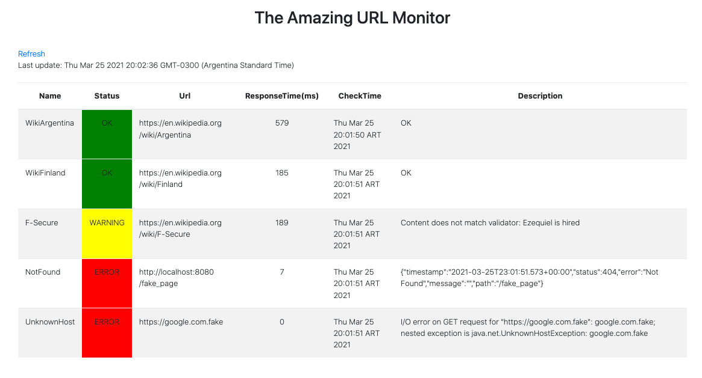

# The Amazing URL Monitor

## Quick-start

### Requirements
- Java 1.8 +
- Maven 3.6.x

### Run Monitor (Unix/macOS)
- Open a terminal and go to root project folder (`monitor`)
- Execute
```
mvn spring-boot:run
```
- On a browser go to `http://localhost:8080/http-monitor`
    - Monitoring page refresh automatically each 30secs. 



### application.properties parameters:
- `logging.level.root`: logging level, default `info`
- `logging.file.name`: full path to the file to be logged, default `monitor.log` under `monitor project folder`
- `monitor.http.defaultCheckPeriodInMillis`: monitoring check period in milliseconds, default `60000`
- `monitor.http.monitoredObjectsFilePath`: full path to `.json` file which has urls to be monitored. default `src/main/resources/urls.json`

### Add urls to be monitored
- modify `src/main/resources/urls.json` file adding/removing url objects
- URL object parameters:
    - name: validator's name
    - url: url to be validated
    - regexValidator: String or regex expression to be found in the page
```
  {
      "name": "WikiFinland",
      "url": "https://en.wikipedia.org/wiki/Finland",
      "regexValidator": "(Arg\\w music | tango)"
  }
```
